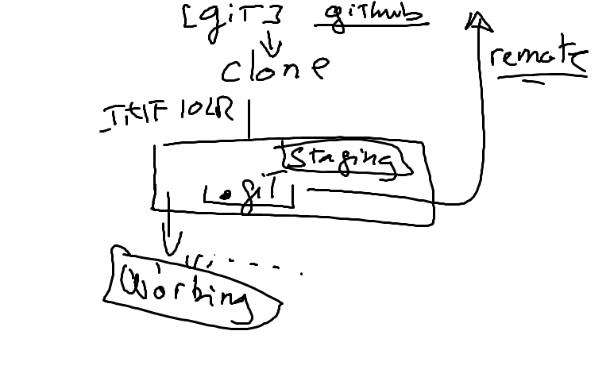

# GIT 

## Installation de la gestion de source

* git Client : https://git-scm.com/downloads
* Clé Personelle de github.com

## Les premiers pas avec git

* Ouvrir la fenetre Git bash
* Creer un repertoire pour faire du developpement
```
$ mkdir Developer
```
* changer de repertoire pour faire du developpement
```
$ cd Developer
```
* Cloner votre premier repertoire git
```
$ git clone https://github.com/CollegeBoreal/INF1042-202-19H-02.git
$ cd INF1042-202-19H-02
```

## Creer son premier fichier sous git (utiliser vi)

* changer de repertoire
```
$ cd 0.GIT
```

* Creer un fichier et l'editer (i.e. remplacer monfichier par votre numero d'etudiant)
```
$ nano monfichier.md
```
* pour sauvegarder => ^o (touche CTRL o)

* pour quitter => ^x  (touche CTRL x)

* mettre le fichier en scene (add to stage)
```
$ git add monfichier.md
```
* donner un commentaire aux fichiers a enregistrer (commit)
```
$ git commit -m "Mon commentaire"
```
* envoyer les modifications locales au serveur github
```
$ git push origin master
```

## Metter a jour mon repertoire local (pull)
```
$ git pull 
```

# Repository



# Configurer git

### .ssh/config
```
Host github.com
    HostName github.com
    User git
    IdentityFile ~/.ssh/github.com.pk
```
